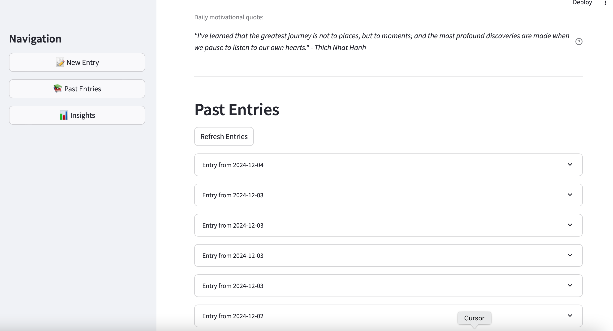

# AI Reflection Journal

An intelligent journaling application that combines personal reflection with AI-powered insights, sentiment analysis, and weather tracking. Built with Streamlit and powered by local LLM (Ollama).

## Features

- 📝 Daily journaling with mood tracking
- 🤖 AI-powered insights using local LLM
- 🌡️ Weather integration
- 📊 Sentiment analysis
- 📈 Mood trends and analytics
- 💭 AI-generated daily motivational quotes
- 🏷️ Mood factors tagging

## Screenshots

### Main Journal Entry Page


_Create new journal entries with mood tracking and AI insights_

### Past Entries View


_Review past entries with AI analysis and weather data_

### Analytics Dashboard


_Track mood trends and analyze patterns over time_

### AI-Powered Insights


_Get therapeutic insights and suggestions from the AI_

## Requirements

- Python 3.8+
- Ollama (for local LLM)
- WeatherAPI.com API key (free tier)

## Installation

1. Clone the repository:
2. Create and activate a virtual environment:

````bash
python -m venv venv
source venv/bin/activate # On Windows: venv\Scripts\activate```

3. Install required packages:
```bash
pip install -r requirements.txt
````

4. Install and set up Ollama:

   - Download and install Ollama from [Ollama's website](https://ollama.ai)
   - Pull the required model:

   ```bash
   ollama pull llama2:3b
   ```

5. Set up WeatherAPI:

   - Sign up for a free API key at [WeatherAPI.com](https://www.weatherapi.com/signup.aspx)
   - Create `.streamlit/secrets.toml` with your configuration:

   ```toml
   [weather]
   openweather_api_key = "your_weatherapi_key_here"
   zip_code = "your_zip_code"
   ```

6. Initialize the database:

```bash
python migrate_db.py
```

## Running the Application

1. Start the Ollama service (if not already running)
2. Launch the application:

```bash
streamlit run app.py
```

The application will be available at `http://localhost:8501`

## Usage Guide

### Creating a New Entry

1. Click on "New Entry" in the sidebar
2. Rate your current mood (1-5)
3. Select relevant mood factors
4. Write your reflection in the text area
5. Click "Save Entry" to store your entry

### Viewing Past Entries

1. Navigate to "Past Entries" in the sidebar
2. Expand entries to view full content
3. See AI insights, weather data, and sentiment analysis
4. Edit or delete entries as needed

### Analyzing Insights

1. Go to "Insights" in the sidebar
2. View mood trends over time
3. Analyze sentiment patterns
4. Track common mood factors

## Project Structure

```
ai-reflection-journal/
├── app.py                 # Main Streamlit application
├── database.py           # Database operations
├── ai_services.py        # AI/LLM integration
├── weather_service.py    # Weather API integration
├── migrate_db.py         # Database migration script
├── requirements.txt      # Python dependencies
├── README.md            # Documentation
├── .gitignore           # Git ignore rules
└── .streamlit/          # Streamlit configuration
    ├── config.toml      # App configuration
    └── secrets.toml     # API keys (not in repo)
```

## Configuration Options

### Streamlit Secrets

Create `.streamlit/secrets.toml`:

```toml
[weather]
openweather_api_key = "your_weatherapi_key"
zip_code = "your_zip_code"
```

### Streamlit Config

The `.streamlit/config.toml` file contains UI customization:

```toml
[theme]
primaryColor = "#FF4B4B"
backgroundColor = "#FFFFFF"
secondaryBackgroundColor = "#F0F2F6"
textColor = "#262730"
font = "sans serif"
```

## Database Schema

The application uses SQLite with the following schema:

```sql
CREATE TABLE entries (
    id INTEGER PRIMARY KEY AUTOINCREMENT,
    date TEXT NOT NULL,
    content TEXT NOT NULL,
    mood INTEGER NOT NULL,
    mood_factors TEXT,
    sentiment REAL,
    entry_type TEXT NOT NULL,
    ai_insight TEXT,
    weather_data TEXT
)
```

## Development

### Setting Up Development Environment

1. Fork the repository
2. Create a new branch for your feature
3. Install development dependencies:

```bash
pip install -r requirements.txt
```

### Code Style

- Follow PEP 8 guidelines
- Use meaningful variable names
- Add comments for complex logic
- Include docstrings for functions

### Testing

Run tests before submitting pull requests:

```bash
python -m pytest tests/
```

## Troubleshooting

### Common Issues

1. **Ollama Connection Error**

   - Ensure Ollama is running
   - Check if the correct model is installed
   - Verify port 11434 is available

2. **Weather API Issues**

   - Verify API key in secrets.toml
   - Check internet connection
   - Validate zip code format

3. **Database Errors**
   - Run migrate_db.py to ensure schema is up to date
   - Check file permissions
   - Verify SQLite installation

## Contributing

1. Fork the repository
2. Create a feature branch
3. Make your changes
4. Submit a pull request

Please ensure your PR:

- Follows the existing code style
- Includes appropriate tests
- Updates documentation as needed
- Describes the changes made

## License

MIT License. See [LICENSE](LICENSE) for details.

## Acknowledgments

- Built with [Streamlit](https://streamlit.io/)
- LLM support by [Ollama](https://ollama.ai/)
- Weather data from [WeatherAPI.com](https://www.weatherapi.com/)
- Sentiment analysis using [TextBlob](https://textblob.readthedocs.io/)

```

This complete documentation now includes:
- Detailed installation steps
- Usage guide
- Project structure
- Configuration options
- Database schema
- Development guidelines
- Troubleshooting section
- Contributing guidelines
- License information
- Acknowledgments

The documentation should help both users and developers understand and work with the application effectively.
```
